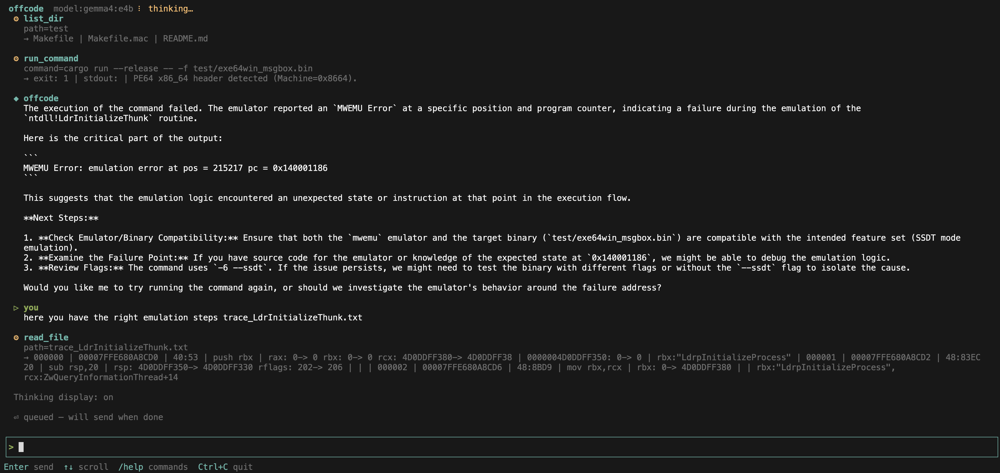

# offcode


```
      ╭──────────╮
      │  ◉    ◉  │   offcode  model:gemma4:e4b
      │   ╰──╯   │   offline coding assistant
      ╰──────────╯   powered by ollama · type a prompt to begin
```




## What is this?

This is a commandline based coding agent that it's really 100% offline, it just connect to ollama locally.
I created this this because projects like opencode makes tcp connections even using offline mode.
Use your favourite [Ollama](https://ollama.com) model for coding your private projects. No cloud. No API keys. No telemetry. Just you and your model.

Works like Claude Code or OpenCode but talks only to a local Ollama instance but keeping your privacy.

## Features

- **Full TUI** — scrollable chat interface with live streaming output
- **Tool use** — reads/writes files, runs shell commands, searches code
- **Agentic loop** — chains multiple tool calls autonomously until the task is done
- **Think support** — shows or hides Qwen3/Deepseek reasoning tokens
- **Config file** — persistent settings at `~/.config/offcode/config.toml`
- **Pure Rust** — minimal dependencies, static Linux binaries, no runtime deps
- **Single-shot mode** — pipe-friendly for scripting

## Requirements

- [Ollama](https://ollama.com) running locally (`ollama serve`)

- download a good model:
ollama pull gemma4:e4b

## Install

### From cargo

```
cargo install offcode
```

### From source

```bash
git clone git@github.com:sha0coder/offcode.git
cd offcode
make build
make install          # → /usr/local/bin/offcode
# or
make install-user     # → ~/.local/bin/offcode
```


## Usage

```bash
# recommended way: Interactive TUI
offcode
/model gemma4:e4b

# Single prompt (non-interactive, pipe-friendly)
offcode 'explain src/main.rs'
offcode 'write unit tests for the auth module'
offcode 'find all TODO comments in this project'

# Different model
offcode -m llama3.2 'refactor this codebase'

# Show thinking tokens (Qwen3, DeepSeek-R1, etc.)
offcode --think

# Plain terminal mode (no TUI)
offcode --no-tui
```

## TUI key bindings

| Key | Action |
|-----|--------|
| `Enter` | Send message |
| `↑` / `↓` | Scroll messages |
| `PgUp` / `PgDn` | Scroll faster |
| `←` / `→` | Move cursor in input |
| `Home` / `End` | Jump to start/end of input |
| `Backspace` | Delete char before cursor |
| `Ctrl+C` | Quit |

## REPL commands (TUI and `--no-tui`)

| Command | Action |
|---------|--------|
| `/help` | Show help |
| `/clear` | Clear conversation history |
| `/tools` | List available tools |
| `/model <name>` | Switch Ollama model |
| `/think` | Toggle thinking token display |
| `/exit` | Quit |

## Available tools

| Tool | Description |
|------|-------------|
| `read_file` | Read file contents (with line numbers for code) |
| `write_file` | Write or overwrite a file |
| `run_command` | Execute shell commands |
| `list_dir` | List directory contents |
| `search_files` | Search for patterns recursively |
| `create_dir` | Create directories |
| `delete_path` | Delete a file or empty directory |
| `path_info` | File/directory metadata |

## Configuration

Config file is created automatically at first run:

**macOS:** `~/Library/Application Support/offcode/config.toml`  
**Linux:** `~/.config/offcode/config.toml`

```toml
model = "gemma4:e4b"
ollama_url = "http://localhost:11434"
temperature = 0.6
num_ctx = 16384
show_thinking = false
max_tool_iters = 30
system_prompt = "You are offcode..."
compact_prompt = "You are compressing the conversation above..."
```

View current config:
```bash
offcode --config
```

## Cross-compilation

```bash
# Install cross (needs Docker)
cargo install cross

# Build for all platforms
make dist

# Outputs to dist/:
#   offcode-<ver>-linux-x86_64     (static, runs on any Linux)
#   offcode-<ver>-linux-arm64      (static, Raspberry Pi / Graviton)
#   offcode-<ver>-macos-x86_64    (Intel Mac)
#   offcode-<ver>-macos-arm64     (Apple Silicon)
#   offcode-<ver>-macos-universal  (fat binary, both)
```

## Dependencies

| Crate | Purpose |
|-------|---------|
| `ureq` | HTTP client for Ollama API (pure Rust, no tokio) |
| `serde` + `serde_json` | JSON serialization |
| `toml` | Config file parsing |
| `dirs` | XDG config directory |
| `ratatui` | Terminal UI |

No async runtime. No OpenSSL. Fully offline after model is pulled.

## License

MIT
